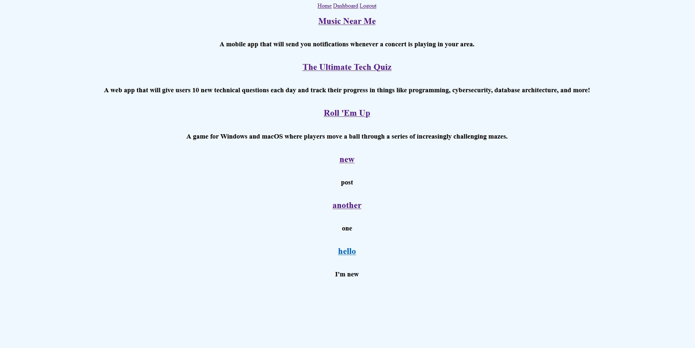
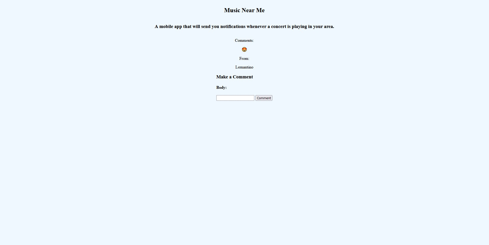
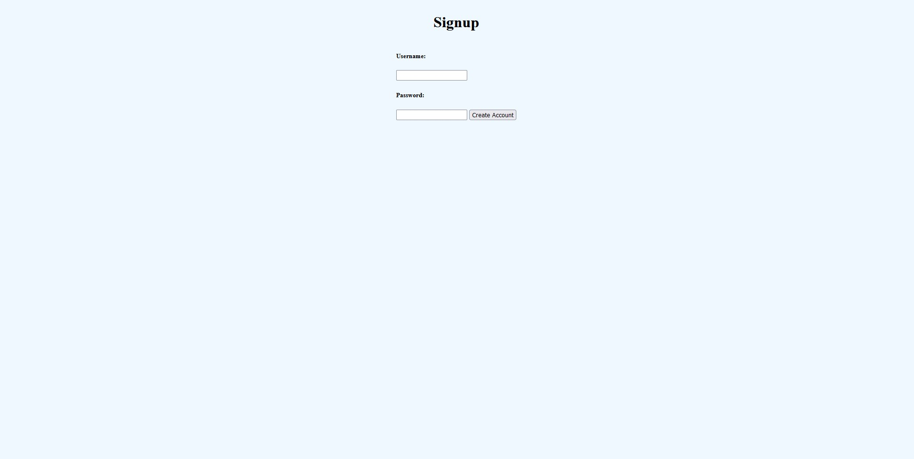
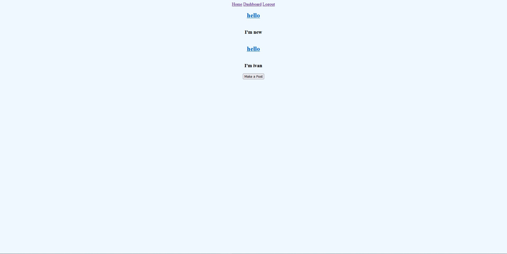
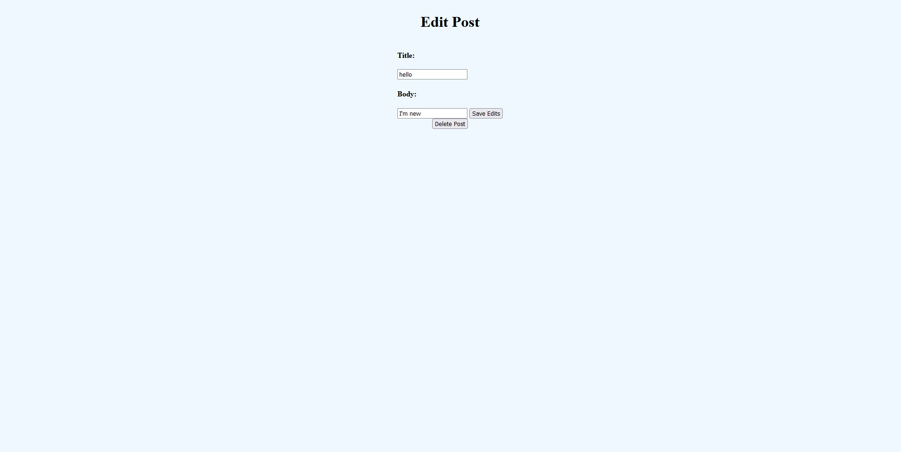
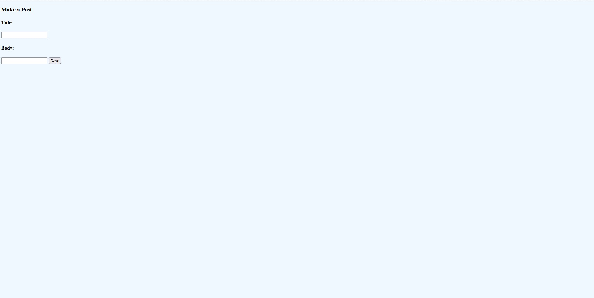

# HELLO WORLD

## Description

Hello World is a simple blog site where users can signup and begin making posts, commenting on others' posts, and editing their own posts. Once an account has been created, users can login to view their previous posts, leave comments on other posts, and make edits to their posts if they wish.

[Click here to visit the live site!](https://hello-world-blogsite.herokuapp.com/)

## Table of Contents

- [Installation](#installation)  
- [Usage](#usage)  
- [Credits](#credits)  
- [Features](#features)  
- [License](#license)  

## Usage

- On page load, visitors to the site are greeted with posts from existing users which they can view all together or in more detail if they simply click the post title. When looking at an individual post, that post's comments will display just underneath. If you're logged in, you are also able to leave your comment on posts by entering some text and clicking "Comment"!

- Existing users can login in through the login page or signup through the signup page. If not signed in, clicking on Dashboard will redirect to login page.

- Once logged in, users will be directed to their Dashboard which will populate with their posts. Clicking on a post from the Dashboard will allow users to make edit to that post.

- Users are able to write new posts by clicking on the Make a Post button in their Dashboard.

## Features
- Write and edit posts
- Comment on posts
- Create account

## License

Licensed under the MIT License